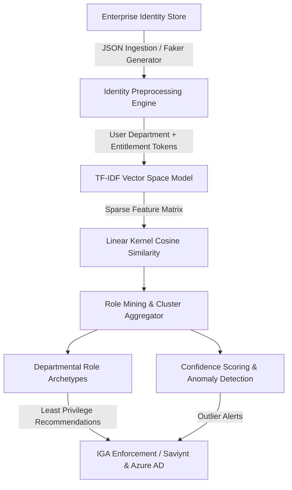

# User-Role-Recommendations: Enterprise IAM Least-Privilege Role Mining Engine

[](https://github.com/ha4kerspidersks/User-Role-Recommendations/actions/workflows/ci.yml)
[](https://opensource.org/licenses/MIT)
[](https://www.python.org/downloads/)
[](https://scikit-learn.org/)
[](https://csrc.nist.gov/publications/detail/sp/800-53/rev-5/final)

> **Autonomous Identity Governance & Administration (IGA) role-mining and privilege anomaly detection system using vector space modeling and cosine similarity.**

---

## 📌 Executive Overview

In large enterprises governing hundreds of thousands of identities (e.g. across Saviynt IGA, Microsoft Entra ID, and Workday), **privilege creep** and **entitlement accumulation** create critical security exposure. 

`User-Role-Recommendations` implements an automated machine-learning pipeline that analyzes enterprise user-entitlement distributions, constructs departmental vector space representations, identifies candidate role archetypes, and computes statistical confidence scores to enforce **Least-Privilege Role-Based Access Control (RBAC)**.

---

## 🏛️ System Architecture



---

## 🔬 Mathematical & Algorithmic Foundation

### 1. Vector Space Representation (TF-IDF)
Each identity $u_i$ is mapped to a composite document combining departmental context and entitlement identifiers:
$$d_i = 	ext{Department}_i \cup \{e_{i,1}, e_{i,2}, \dots, e_{i,k}\}$$

The Term Frequency-Inverse Document Frequency weight $w_{t, d}$ for entitlement token $t$ in identity document $d$ across identity corpus $D$ is computed as:
$$	ext{TF-IDF}(t, d, D) = 	ext{TF}(t, d) 	imes \ln\left(rac{1 + |D|}{1 + |\{d \in D : t \in d\}|}
ight) + 1$$

### 2. Pairwise Identity Similarity (Linear Kernel)
The privilege distance between identities is calculated using the cosine similarity metric:
$$	ext{Sim}(u_a, u_b) = rac{\mathbf{v}_a \cdot \mathbf{v}_b}{\|\mathbf{v}_a\| \|\mathbf{v}_b\|}$$

Identities exhibiting high cosine similarity within the same operational department cluster into natural enterprise roles, mitigating role explosion and eliminating orphan entitlements.

---

## 🚀 Getting Started

### Prerequisites
- Python 3.10 or 3.11+
- Git

### Installation

```bash
# 1. Clone repository
git clone https://github.com/ha4kerspidersks/User-Role-Recommendations.git
cd User-Role-Recommendations

# 2. Set up virtual environment
python3 -m venv .venv
source .venv/bin/activate

# 3. Install dependencies
pip install -r requirements.txt
```

### Running the Role Mining Engine

```bash
python3 aiRole.py
```

### Running Automated Test Suite

```bash
python3 -m unittest discover -s tests
```

---

## 📊 Sample Output

### Discovered Role Archetypes
```text
+-------------+----------------------+-------+
| Department  |     Entitlements     | Count |
+-------------+----------------------+-------+
| Engineering | ['E1', 'E3', 'E7']   |    42 |
| IT          | ['E2', 'E4', 'E8']   |    38 |
| Finance     | ['E1', 'E5']         |    31 |
| HR          | ['E6', 'E9']         |    29 |
+-------------+----------------------+-------+
```

### Departmental Entitlement Confidence
```text
Recommendations for Department 'IT':
1. E4: 84.20% confirmation
2. E2: 78.50% confirmation
3. E8: 65.10% confirmation
```

---

## 🔒 Security & Compliance Alignment

- **NIST SP 800-53 Rev. 5 (AC-6):** Least Privilege enforcement by identifying outlier entitlements not aligned with peer departmental baselines.
- **SOX Section 404:** Automated segregation of duties (SoD) verification and role reconciliation auditability.
- **ISO/IEC 27001 (A.9.2):** User access provisioning and periodic access reviews powered by empirical clustering.

---

## 📄 License
This project is licensed under the [MIT License](LICENSE).
