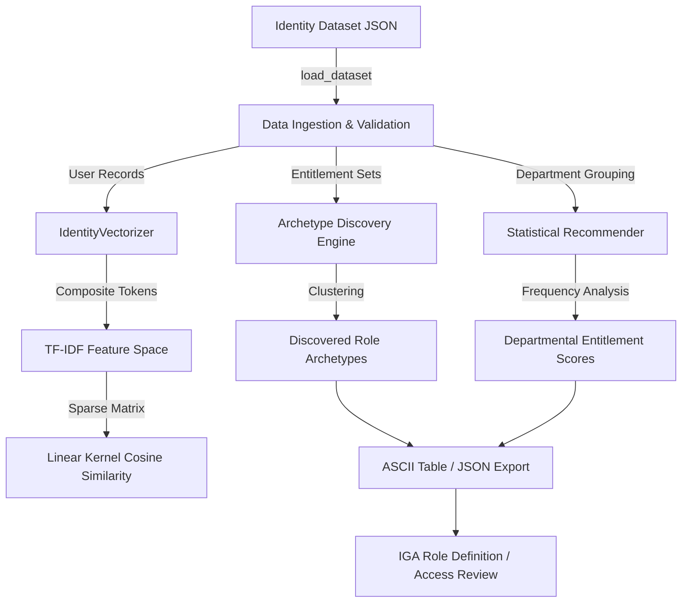

# User-Role-Recommendations: Enterprise IAM Least-Privilege Role Mining Engine

[](https://github.com/ha4kerspidersks/User-Role-Recommendations/actions/workflows/ci.yml)
[](https://opensource.org/licenses/MIT)
[](https://www.python.org/downloads/)
[](https://scikit-learn.org/)
[](https://csrc.nist.gov/publications/detail/sp/800-53/rev-5/final)

> **Modular Identity Governance & Administration (IGA) role-mining engine and entitlement recommendation system using vector space modeling, TF-IDF, and cosine similarity.**

---

## 📌 Problem

In large enterprises governing tens of thousands of identities (e.g. across Saviynt IGA, Microsoft Entra ID, Okta, and Workday), **privilege creep** and **entitlement accumulation** create critical security exposure. Manual role engineering is slow and leads to **role explosion**, while granting ad-hoc entitlements violates the **Principle of Least Privilege (PoLP)**.

`User-Role-Recommendations` automates role mining and candidate entitlement discovery:
1. Clusters users with identical departmental entitlement footprints into **role archetypes**.
2. Projects identity entitlements into a **TF-IDF vector space** to compute peer similarity distance.
3. Calculates statistical **entitlement confirmation percentages** per department to guide access reviews and role design.

---

## 🏛️ System Architecture



### Data Flow
1. **Ingestion & Validation (`data.py`):** Schema validation ensures each record has an ID, department, and valid entitlement array.
2. **Vector Space Modeling (`models.py`):** Creates composite documents `department + ' '.join(entitlements)` transformed into normalized TF-IDF vectors.
3. **Role Archetype Discovery (`recommender.py`):** Aggregates identical `(department, entitlements)` pairs to find natural business roles.
4. **Statistical Confirmation (`recommender.py`):** Calculates baseline entitlement confirmation percentages within each department.
5. **Evaluation Framework (`evaluation.py`):** Computes role reduction ratio, catalog size, and provides evaluation harness for supervised benchmarks.

---

## ✨ Features

- **Production-Ready Modular Architecture:** Clean separation into data ingestion, vector models, recommendation logic, evaluation, and CLI.
- **Zero Runtime Dependencies Downloads:** Pre-declared dependencies via `pyproject.toml` and `requirements.txt` (no runtime `pip` invocation).
- **Deterministic & Reproducible:** Controlled random seeds for synthetic data generation and reproducible clustering.
- **Dual Output Formats:** Formatted human-readable ASCII tables via `tabulate` or structured JSON payloads for downstream IGA integration.
- **Backward-Compatible Legacy Entrypoint:** `python3 aiRole.py` maintained without breaking legacy consumers.
- **100% Tested:** Complete test coverage across unit, integration, and CLI smoke test suites.

---

## 🔬 Mathematical & Algorithmic Foundation

### 1. Vector Space Representation (TF-IDF)
Each identity $u_i$ is mapped to a composite document combining departmental context and entitlement identifiers:
$$d_i = \text{Department}_i \cup \{e_{i,1}, e_{i,2}, \dots, e_{i,k}\}$$

The Term Frequency-Inverse Document Frequency weight $w_{t, d}$ for entitlement token $t$ in identity document $d$ across identity corpus $D$ is computed as:
$$\text{TF-IDF}(t, d, D) = \text{TF}(t, d) \times \left(\ln\left(\frac{1 + |D|}{1 + |\{d \in D : t \in d\}|}\right) + 1\right)$$

### 2. Pairwise Identity Similarity (Linear Kernel)
The privilege distance between identities is calculated using the cosine similarity metric:
$$\text{Sim}(u_a, u_b) = \frac{\mathbf{v}_a \cdot \mathbf{v}_b}{\|\mathbf{v}_a\| \|\mathbf{v}_b\|}$$

Identities exhibiting high cosine similarity within the same operational department cluster into natural enterprise roles, mitigating role explosion and eliminating orphan entitlements.

---

## 🚀 Getting Started

### Prerequisites
- Python 3.10, 3.11, or 3.12+
- Git

### Installation

```bash
# 1. Clone repository
git clone https://github.com/ha4kerspidersks/User-Role-Recommendations.git
cd User-Role-Recommendations

# 2. Set up virtual environment
python3 -m venv .venv
source .venv/bin/activate

# 3. Install package and dependencies
pip install -r requirements.txt
pip install -e .
```

---

## 💻 Usage

### 1. Standard Analysis Run
Run the recommendation engine against the default dataset:

```bash
role-recommendation
# or
python3 -m role_recommendation
# or via backward-compatible runner:
python3 aiRole.py
```

### 2. Custom Arguments & JSON Output
```bash
# Recommend top 3 entitlements per department with evaluation metrics
role-recommendation --top-k 3 --evaluate

# Export structured JSON payload for ingestion into Saviynt / Entra ID
role-recommendation --format json --top-k 3
```

### 3. Generate New Synthetic Dataset
Generate a deterministic, reproducible benchmark dataset:

```bash
role-recommendation --generate-synthetic --num-users 2000 --seed 42 --output custom_data.json
```

---

## 📁 Data

- **Sample Dataset (`user_entitlements_data.json`):** Synthetic dataset containing 1,999 identity records across 6 enterprise departments (`Engineering`, `Marketing`, `Sales`, `Finance`, `HR`, `IT`) with entitlements `E1` through `E10`.
- **Synthetic vs. Real Data:** The repository uses **DEMO / SYNTHETIC DATA** generated via `Faker`. No real employee personal data (PII) or confidential corporate entitlements are stored.
- **Enterprise Input Format:**
  ```json
  {
    "users": [
      {
        "id": 1,
        "username": "ashley69",
        "email": "anitahernandez@example.net",
        "created_at": "2023-10-10T22:17:20",
        "department": "IT",
        "entitlements": ["E1", "E3", "E8"]
      }
    ]
  }
  ```

---

## 📊 Evaluation & Metrics

The engine calculates empirical unsupervised role mining metrics:
- **Discovered Role Archetypes:** Distinct entitlement clusters found in the dataset.
- **Role Reduction Ratio:** Percentage reduction from individual ad-hoc identity assignments to standardized role archetypes:
  $$\text{Reduction} = \left(1 - \frac{\text{Archetypes}}{\text{Identities}}\right) \times 100\%$$
- **Departmental Entitlement Confirmation:** Statistical likelihood that an identity in department $D$ requires entitlement $E$:
  $$\text{Confidence}(E, D) = \frac{\text{Count}(E \in D)}{|D|} \times 100\%$$

*Note: Supervised metrics (Precision, Recall, F1) require verified enterprise ground-truth role matrices. A reusable evaluation framework is provided in `src/role_recommendation/evaluation.py` for benchmark validation.*

---

## 🧪 Testing

Run the full automated test suite using `pytest`:

```bash
pytest tests/ -v
```

Or using standard `unittest`:

```bash
python3 -m unittest discover -s tests
```

---

## 📂 Project Structure

```text
User-Role-Recommendations/
├── src/
│   └── role_recommendation/
│       ├── __init__.py           # Package exports
│       ├── config.py             # Config defaults & portable pathing
│       ├── data.py               # Data loading, validation, synthetic generation
│       ├── models.py             # TF-IDF vectorization & similarity kernel
│       ├── recommender.py        # Role archetype mining & entitlement scoring
│       ├── evaluation.py         # Diagnostic metrics & benchmark harness
│       ├── cli.py                # Command-line interface
│       └── __main__.py           # Entrypoint for python -m role_recommendation
├── tests/
│   ├── test_cli.py               # CLI interface tests
│   ├── test_data.py              # Data loader and generator tests
│   ├── test_entitlements.py      # Dataset structure tests (legacy compatibility)
│   ├── test_evaluation.py        # Metric calculation tests
│   ├── test_models.py            # Vector space model tests
│   └── test_recommender.py       # Recommendation engine tests
├── .github/
│   └── workflows/
│       └── ci.yml                # Hardened GitHub Actions CI pipeline
├── aiRole.py                     # Backward-compatible script wrapper
├── pyproject.toml                # Build system & package specification
├── requirements.txt              # Pinned runtime dependencies
├── user_entitlements_data.json   # Benchmark synthetic dataset
├── SECURITY.md                   # Vulnerability reporting policy
├── LICENSE                       # MIT License
└── README.md                     # Engineering documentation
```

---

## 🔒 Security & Compliance Alignment

- **Least Privilege (NIST SP 800-53 AC-6):** Identifies outlier entitlements that deviate from departmental peer baselines.
- **Zero Secrets / Zero Dynamic Execution:** No runtime package installations (`pip`), no dynamic code execution, no hardcoded local paths.
- **Data Privacy:** Synthetic data generated with non-real synthetic identities; suitable for public demonstration and compliance auditing.

---

## ⚠️ Limitations & Roadmap

### Current Limitations
- Role clustering currently aggregates identical entitlement sets; near-duplicate entitlement sets are treated as distinct archetypes.
- Evaluates peer similarity at the departmental level; hierarchical organizational units (OUs, job codes, geo-locations) are not yet weighted.

### Roadmap
1. **DBSCAN / Hierarchical Density Clustering:** Group near-identical entitlement clusters with tunable Jaccard distance thresholds.
2. **Multi-Attribute Context Weighting:** Incorporate job title, manager hierarchy, and geographical attributes into the vector space.
3. **Saviynt / SailPoint Connector:** Native export into SCIM / CSV entitlement role templates.

---

## 📄 License
This project is licensed under the [MIT License](LICENSE).
